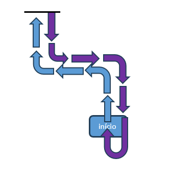

# Challenge 001 - SOBOT STARTER

## 🎯 Challenge Objective
The goal of this challenge is to use the SoBot to demonstrate the concepts used for robot movement and to use light signaling to indicate the direction of movement.

### Basic
Program the SoBot to execute a sequence of movements using **fixed commands** and for each change of direction, change the color of the LED strip. For curves, use the curve mode on the axis itself.

The movement sequence and LED colors are:
|N° | Direction| Led Color|
|--|--| -- |
|1|Forward | Green
|2|Left | Blue
|3|Forward | Green
|4|Right| Yellow
|5|Forward | Green
|6|Backward | Red
|7|Right| Yellow
|8|Forward | Green
|9|Right| Yellow
|10|Forward | Green
|11|Right| Yellow

### Intermediate
Perform the same path as the previous task, now with **continuous movement** and **differential turns**.

### Advanced
Execute the same path as the previous tasks using motor control in **pulses-per-second mode**, allowing **any type of turn**.

## 🌟 Tips
- Refer to the **Commands used for movement in fixed commands mode** section in the Command Guide.
- Refer to the **Set of commands used for movement in continuous mode** section in the Command Guide.
- Refer to the **Motor control commands in Pulses-per-Second mode** section in the Command Guide.
- Check out the example program on GitHub:[Simple Route](https://github.com/SolisTecnologia/SoBot-Simple-Route)
