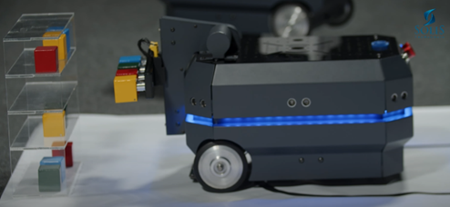

# Challenge 003 - SOBOT MAGNETO

## 🎯 Challenge Objective
The goal of this challenge is to explore the Electromagnet Module integrated with the Fork Lift Module, allowing the SoBot to manipulate metallic objects. This includes assembling the module, controlling the electromagnet's functionality, and developing programming logic to simulate logistics picking system.

### Basic

With the lift module installed on the SoBot’s top cover, assemble the Magneto Module following the instructions in our video available on [YouTube](https://youtu.be/XTq0hs1Pg6g?list=PLJpodHj3AF0-VNTDBlsqiOu7pw9HkQsv-&t=340) and in the "SOBOT HANDBOOK" (3nd Edition – 2024, p. 81).

CAUTION: Perform the electrical wiring for the lift module with the electromagnet as instructed in the "APOSTILA SOBOT" (3nd Edition – 2024, p. 82) to avoid electrical issues or damage.
    

### Intermediate
After assembling the lift module with the electromagnet, control its respective relays (digital output). First, pick up the metal boxes using the electromagnet, then raise and lower the lift, and finally release the boxes.

### Advanced
 1. After controlling the electromagnets, simulate collecting the metal boxes to be placed on the acrylic shelf provided with the SoBot kit.

## 🌟Tips
- Check the **Set of commands for controlling digital outputs** section in the Command Guide.
- Refer to the APOSTILA SOBOT starting on page 81 (3nd Edition – 2024).
- Watch the videos on our [YouTube channel](https://www.youtube.com/@solistecnologia/videos).