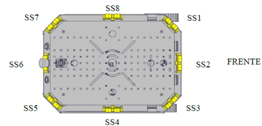
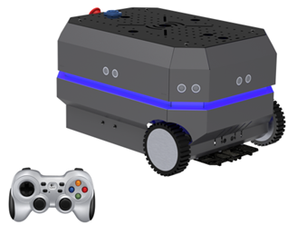

# Challenge 004 - SOBOT REMOTE CONTROL
## 🎯 Challenge Description
In this challenge, you will use the Sonar Sensors and the USB Remote Control to control the SoBot, change the colors of the LED strip, and implement advanced detection and movement functionalities.

### Basic
Program the SoBot to read individual Sonar sensors as well as all sensors simultaneously. Change the LED strip color based on the distance detected by the sensors, following this table: 

 Distance| Led Color |
|--| -- |
Greater than 40 cm | Green
Between 40 and 20 cm | Yellow
Less than 20 cm | Red

### Intermediate 

Connect the USB remote control as described in the [YouTube](https://www.youtube.com/watch?v=F4W7lwZRuD0&list=PLJpodHj3AF0-VNTDBlsqiOu7pw9HkQsv-&index=8) tutorial. Develop a program to control the SoBot's movements and change the LED strip colors using the remote control buttons.

### Advanced
After completing the previous procedures, develop a code that makes the SoBot move while scanning with the Sonar sensors and changes the LED strip color according to the table from the basic level. Also, implement an algorithm to pause the motors if an object is detected 10 cm from the SoBot.

## 🌟Tips
Check the **Commands for reading SONAR sensors** section in the Command Guide.
Watch videos on the [Youtube Channel](https://www.youtube.com/@solistecnologia/videos).
Check out the example programs on GitHub: [Sobot-Ultrasonic-Sensor](https://github.com/SolisTecnologia/SoBot-Ultrasonic-Sensor) e [SoBot Basic Control Logitech F710](https://github.com/SolisTecnologia/SoBot-Basic-Control-Logitech-F710) 